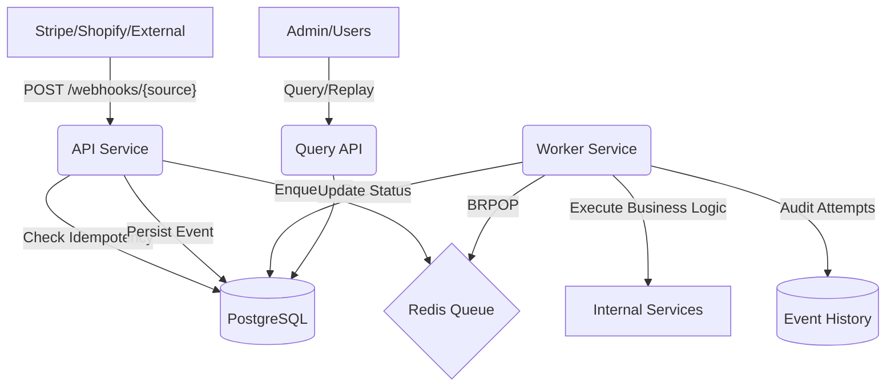

# RelayCore: Webhook Ingestion & Event Processing Engine

RelayCore is a production-grade infrastructure service designed to handle millions of webhooks with guaranteed at-least-once delivery, idempotency, and auditability.

## Architecture Diagram



## Features

### 1. Idempotency Strategy
We use a Database-Level Unique Constraint on the tuple (source, external_event_id). 
- When a webhook arrives, we first check if this pair exists in PostgreSQL.
- If it exists, we return 200 OK immediately without re-queueing or re-processing.
- This prevents duplicate processing even if the external provider sends the same event multiple times.

### 2. Retry Strategy (Exponential Backoff)
Failures are handled using a multi-stage retry policy:
- 1st Retry: 10 seconds after failure.
- 2nd Retry: 30 seconds after failure.
- 3rd Retry: 2 minutes after failure.
- Final: If the 4th attempt fails, the event is marked as FAILED and requires manual intervention or a Replay trigger.

### 3. How Replay Works
The POST /events/{id}/replay endpoint allows manual recovery for FAILED events.
- It resets the retry_count and status to RECEIVED.
- It pushes the internal event_id back to the Redis queue.
- This allows engineers to fix bugs and re-run all failed events without requiring the external provider to resend them.

### 4. Guaranteed Consistency
We follow a Transactional Outbox Pattern (simplified):
- The API saves the event to PostgreSQL and pushes to Redis in a single logical flow.
- The Worker marks the event as PROCESSING in a DB transaction before starting work.
- Status is only updated to PROCESSED after the business logic completes successfully.

### 5. Race Condition Prevention
- We use Atomic DB Transitions. An event can only move from RECEIVED to PROCESSING once.
- Redis BRPOP ensures that a message is only delivered to one worker at a time.
- Database unique constraints act as a final safety valve against race conditions during high-concurrency bursts.

### 6. Crash Recovery
- Redis AOF: Redis is configured with Append Only File persistence to survive restarts without losing the queue.
- DB Recovery: If a worker crashes mid-processing, the event remains in the PROCESSING state in PostgreSQL. A simple reconciliation query can identify and re-queue these stuck events.

## Setup & Deployment

### Prerequisites
- Docker & Docker Compose

### Quick Start
Run the entire stack (API, Worker, Postgres, Redis) with a single command:

```bash
docker compose up --build
```

### Services
- API: Accessible at http://localhost:8080. Handles webhook ingestion and queries.
- Worker: Background service polling Redis for jobs.
- Postgres: Port 5432. Source of truth for all events.
- Redis: Port 6379. High-speed message queue.

### Testing
To run the unit and integration tests:
```bash
./mvnw test
```

## Monitoring
Check system health via the metrics endpoint:
GET http://localhost:8080/events/metrics
